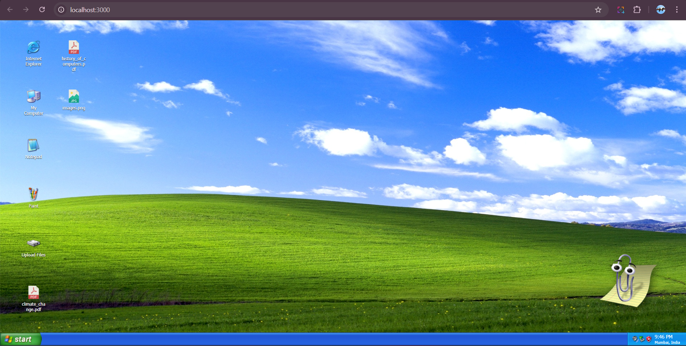
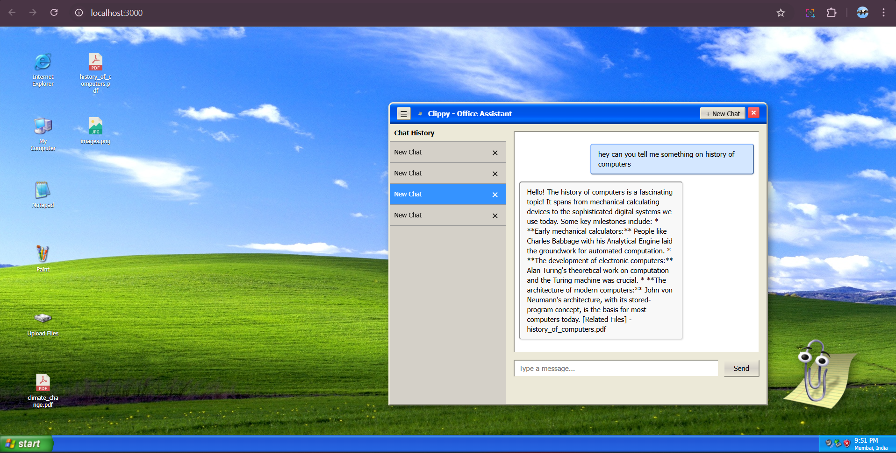
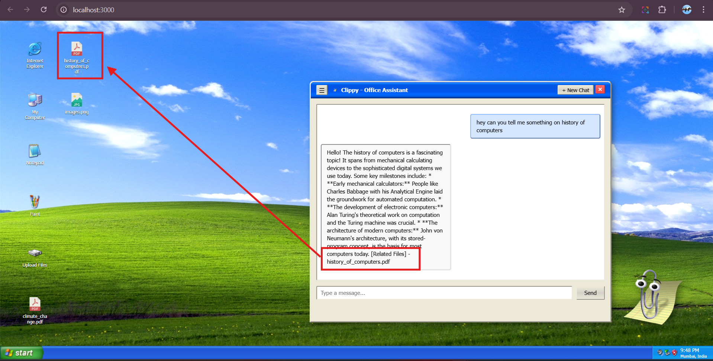

# AI Second Brain - Windows XP Edition

A nostalgic Windows XP-themed AI knowledge management system that lets you chat with your documents using RAG (Retrieval Augmented Generation).

## Features

- **Windows XP UI** - Authentic retro interface with draggable windows, start menu, and classic design
- **AI Chat with Memory** - Remembers previous conversations and maintains context across chat sessions
- **Intelligent Document Retrieval** - Automatically fetches relevant files from your knowledge base based on chat topics
- **Document Processing** - Upload and process PDF, TXT, and image files with OCR support
- **Vector Search** - Semantic search powered by Qdrant for accurate context retrieval
- **Chat Session Management** - All conversations are saved and organized for easy reference
- **Smart File Tagging** - Automatically tags chats with related documents from your system
- **Cloud Storage** - Supabase for secure document management and metadata

## Tech Stack

**Frontend:**
- React 16.8 with Windows XP UI components
- Deployed on Vercel

**Backend:**
- Flask API with CORS support
- Google Gemini AI for chat responses
- Qdrant Cloud for vector embeddings
- Supabase for PostgreSQL + Storage
- Sentence Transformers for embeddings
- PyPDF2 + Tesseract for document processing

## Quick Start

### Prerequisites

- Node.js 14+
- Python 3.12+
- Supabase account
- Qdrant Cloud account
- Google AI API key

### Installation

1. **Clone the repository**
```bash
git clone https://github.com/Wilfred2668/AI_Second_Brain.git
cd AI_Second_Brain
```

2. **Backend Setup**
```bash
cd winXP/backend
pip install -r requirements.txt

# Create .env file with:
SUPABASE_URL=your_supabase_url
SUPABASE_KEY=your_supabase_key
QDRANT_URL=your_qdrant_url
QDRANT_API_KEY=your_qdrant_api_key
GEMINI_API_KEY=your_gemini_api_key
COLLECTION_NAME=knowledge_base
VECTOR_SIZE=384
FLASK_ENV=development
FRONTEND_URL=http://localhost:3000

# Run backend
python app.py
```

3. **Frontend Setup**
```bash
cd winXP
npm install

# Create .env file with:
REACT_APP_API_URL=http://localhost:5000

# Run frontend
npm start
```

4. **Access the app**
- Frontend: http://localhost:3000
- Backend API: http://localhost:5000

## Live Demo

🚀 **[Try it here: https://ai-second-brain-551r.vercel.app](https://ai-second-brain-551r.vercel.app)**

## Screenshots


*Classic Windows XP desktop interface with iconic start menu, taskbar, and desktop shortcuts*


*Fully functional multi-window environment - drag, resize, minimize, and maximize windows just like the original XP*


*Simple file upload interface on the home page - supports PDF documents, text files, and images for OCR processing*


*Click Clippy to start chatting - all conversation history is preserved and easily accessible for reference*


*AI automatically identifies and tags relevant files when your chat relates to documents in your knowledge base*

## Usage

1. **Upload Documents** - Use the upload interface on the home page to add PDF, TXT, PNG, or JPG files
2. **Automatic Processing** - Documents are processed, embedded, and stored in your vector database
3. **Start Chatting** - Click on Clippy to open the chat interface
4. **Contextual Conversations** - The AI remembers previous chats and maintains conversation context
5. **Smart Retrieval** - Ask questions about any topic - if relevant files exist in your system, they're automatically fetched
6. **Tagged References** - Conversations are automatically tagged with related documents for easy tracking
7. **Session Management** - All chat sessions are saved and can be resumed anytime


## Author

Built with ❤️ using React and Flask
